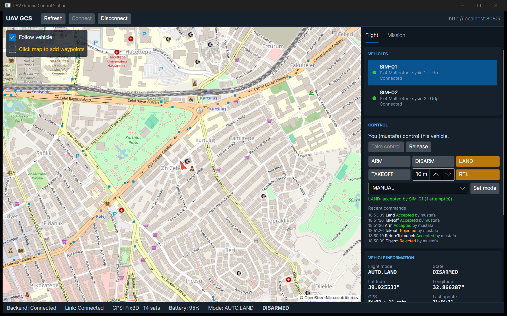
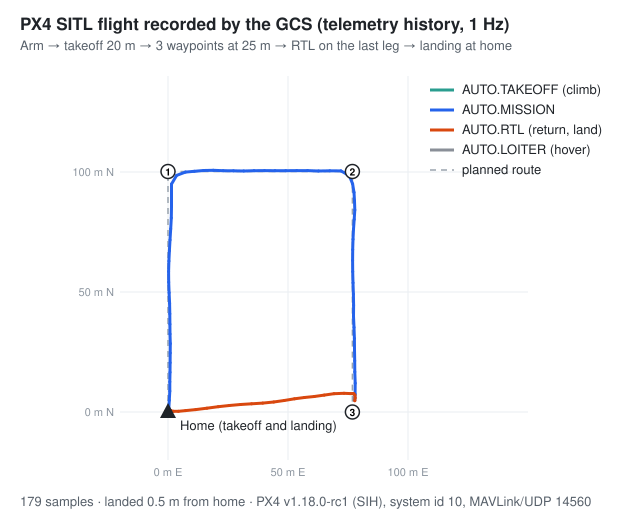

# UAV Ground Control Station

[](https://github.com/mustafaklee/uav-ground-control-station/actions/workflows/ci.yml)

A modular, testable ground control station (GCS) for managing multiple UAVs over MAVLink, built with .NET 10,
ASP.NET Core, PostgreSQL, RabbitMQ, SignalR and Avalonia UI. It is engineered like a defence-industry product:
reliability, safety, security and observability come before features.

> **Status: Phase 9, observability.** OpenTelemetry traces and metrics, with logs correlated by trace id. One trace
> follows an operator action from the HTTP request through PostgreSQL to the MAVLink exchange. The trace context
> travels through the outbox into RabbitMQ message headers. `/health/details` reports vehicle links, the outbox backlog
> and history writes. `docker compose` includes the Aspire dashboard at http://localhost:18888. See
> [docs/observability.md](docs/observability.md).
>
> Phase 8, security: Users sign in (JWT access tokens for 15 minutes, rotating refresh tokens with reuse
> detection). Four roles map to permission policies, and a test checks every endpoint against every role. Passwords are
> hashed with PBKDF2 and accounts lock after repeated failures. The API is rate limited and sends defensive headers, and
> secrets come only from user-secrets or `.env`. The desktop client has a sign-in window. See
> [docs/security.md](docs/security.md).
>
> Phase 7, command system: Operators take control of a vehicle (one operator per vehicle, expiring command
> lease) and send ARM, DISARM, TAKEOFF, LAND, RTL and SET_MODE. Each command waits for the vehicle's COMMAND_ACK with a
> timeout and bounded retries, a duplicate in flight is refused, critical commands need confirmation, and every
> attempt is written to an append-only audit log in PostgreSQL. See [docs/commands.md](docs/commands.md).
>
> Phase 6, mission planner: Operators plan missions on the map (takeoff, waypoints, loiter, RTL, land), the
> backend stores and validates them, and the MAVLink mission protocol uploads them to a vehicle and reads them back.
> Vehicle links are restored automatically after an API restart.
>
> Phase 5, desktop GCS: The Avalonia operator client shows the fleet, a live map with the vehicle's heading
> and track, telemetry and battery panels and a status bar, fed by REST and SignalR.
>
> Phase 4, telemetry: Live telemetry is pushed to clients over SignalR (throttled to 5 Hz per vehicle),
> sampled into PostgreSQL as history, and link events reach RabbitMQ through the outbox.
>
> Phase 3, MAVLink: The GCS talks MAVLink 2 to vehicles over UDP/TCP or to a built-in simulator: it tracks
> link health with heartbeats, reconnects with bounded exponential backoff and decodes live telemetry (position,
> attitude, speed, battery, GPS, arm state, flight mode). Vehicles are managed through a versioned REST API backed by
> PostgreSQL. SignalR push and the desktop UI arrive in the phases listed in the [roadmap](#roadmap).



The Mission tab: [docs/images/gcs-desktop-phase6-mission.png](docs/images/gcs-desktop-phase6-mission.png).
Live telemetry before the control panel existed: [docs/images/gcs-desktop-phase5.png](docs/images/gcs-desktop-phase5.png).

## Project overview

The GCS lets operators register vehicles, connect to them over UDP, TCP or serial MAVLink links, watch live telemetry
on a map, plan and upload missions, and send commands (arm, takeoff, mode change, RTL, land) with role-based
authorization and a full audit trail. It runs without hardware against a built-in simulator or PX4 SITL.

## Architecture

Modular monolith with Clean Architecture. See [docs/architecture.md](docs/architecture.md) and the
[architecture decision records](docs/adr/README.md).

```
Avalonia GCS ──REST/SignalR──► Gcs.Api ──► Application ──► Domain
                                  │
                         Infrastructure (composition root)
              ┌──────────────┬────┴─────────┬───────────────┐
         Persistence      Messaging       Mavlink         Telemetry
         (PostgreSQL)    (RabbitMQ)   (UDP/TCP/serial)   (live state)
                                           │
                               PX4 / ArduPilot / SITL / Simulator
```

## Features

| Area | Status |
|---|---|
| Solution structure, analyzers, central package management | ✅ Phase 1 |
| Docker Compose (PostgreSQL, RabbitMQ, Redis, API) | ✅ Phase 1 |
| Structured logging with correlation ids, liveness/readiness health checks | ✅ Phase 1 |
| CI: build, unit, architecture and integration tests, Docker build, compose smoke test | ✅ Phase 1 |
| Vehicle management API (CRUD, paging, ETag concurrency, retire) | ✅ Phase 2 |
| Domain events via transactional outbox → RabbitMQ | ✅ Phase 2 |
| Database migrations (dev: on startup, Docker: migrator container) | ✅ Phase 2 |
| MAVLink 2 codec verified byte-for-byte against pymavlink | ✅ Phase 3 |
| UDP/TCP/in-process simulator transports, heartbeat, reconnect with backoff | ✅ Phase 3 |
| Live telemetry decoding (position, attitude, speed, battery, GPS, mode) | ✅ Phase 3 |
| Simulated PX4 vehicle (in-process and as a UDP container) | ✅ Phase 3 |
| Real-time telemetry and link status over SignalR (throttled, per-vehicle groups) | ✅ Phase 4 |
| Telemetry history: 1 Hz sampling, batched PostgreSQL writes, retention | ✅ Phase 4 |
| Link events (connected, lost, faulted, disconnected) to RabbitMQ via outbox | ✅ Phase 4 |
| Avalonia operator UI: live map (heading, track, home), fleet list, telemetry, battery, status bar | ✅ Phase 5 |
| Mission planner: map editing, server-side validation, drafts, ETag concurrency | ✅ Phase 6 |
| MAVLink mission upload/download with retries, simulator support | ✅ Phase 6 |
| Vehicle links restored after an API restart | ✅ Phase 6 |
| Commands (ARM, DISARM, TAKEOFF, LAND, RTL, SET_MODE) over COMMAND_LONG with ACK timeout and retry | ✅ Phase 7 |
| Command lease (one operator per vehicle), duplicate-in-flight refusal, confirmation of critical commands | ✅ Phase 7 |
| Append-only command audit log in PostgreSQL, desktop control panel | ✅ Phase 7 |
| JWT sign-in, rotating refresh tokens with reuse detection, account lockout | ✅ Phase 8 |
| Roles → permission policies (critical commands need `vehicles.command`), authorization-matrix tests | ✅ Phase 8 |
| Rate limiting (global, login, commands), security headers, secrets outside the repo, desktop sign-in | ✅ Phase 8 |
| OpenTelemetry tracing and metrics, trace context through outbox and RabbitMQ, logs with trace id | ✅ Phase 9 |
| Health monitoring (`/health/details`: links, outbox backlog, history), Aspire dashboard in compose | ✅ Phase 9 |
| Real PX4 SITL (SIH, headless) in Docker over MAVLink/UDP, opt-in compose profile | ✅ Phase 10 |
| Takeoff → mission → RTL flight test against real PX4, own CI job | ✅ Phase 10 |
| One-command install on Ubuntu Server 24.04: Docker Compose, Nginx (TLS, HTTP/2, WebSocket, rate limit), UFW | ✅ Phase 11 |
| Let's Encrypt or internal CA, trusted forwarded headers, daily verified `pg_dump` with retention and restore | ✅ Phase 11 |
| Several vehicles on one UDP port (demultiplexed by system id), unregistered systems detected | ✅ Phase 12 |
| Link quality: 10 s loss window, TIMESYNC round trip, message rate, telemetry radio RSSI, Good/Fair/Poor/Lost | ✅ Phase 12 |
| Network topology API, radio abstraction for future MANET radios, live quality push, `gcs.link.*` gauges | ✅ Phase 12 |

## Technology stack

| Concern | Choice |
|---|---|
| Runtime | .NET 10 (LTS), C# |
| Backend | ASP.NET Core minimal APIs, API versioning (`Asp.Versioning`) |
| Persistence | PostgreSQL 18, EF Core 10, Npgsql |
| Messaging | RabbitMQ 4 (domain events, outbox) |
| Real time | SignalR (`/hubs/telemetry`, `/hubs/vehicles`) |
| Desktop | Avalonia UI 11.3, Mapsui 5 (OpenStreetMap), CommunityToolkit.Mvvm, SignalR client ([ADR-012](docs/adr/ADR-012-desktop-map-and-avalonia-version.md)) |
| MAVLink | Own MAVLink 2 codec, golden-tested against pymavlink ([ADR-010](docs/adr/ADR-010-own-mavlink-codec.md)) |
| Logging | Serilog |
| Testing | xUnit v3 (Microsoft.Testing.Platform), Shouldly, NetArchTest, Testcontainers |
| CI | GitHub Actions |

## Getting started

### Prerequisites

* [.NET SDK 10.0.401+](https://dotnet.microsoft.com/download) (pinned in `global.json`)
* [Docker Desktop](https://www.docker.com/products/docker-desktop/) (WSL 2 backend on Windows) or Docker Engine on Linux
* Git

### Local development

```bash
git clone https://github.com/mustafaklee/uav-ground-control-station.git
cd uav-ground-control-station
cp .env.example .env              # set JWT_SIGNING_KEY and GCS_ADMIN_PASSWORD (see docs/security.md)
docker compose up -d --wait postgres rabbitmq
dotnet build Gcs.slnx
dotnet user-secrets set "Security:BootstrapAdministrator:Password" "<a long passphrase>" --project src/Gcs.Api
dotnet run --project src/Gcs.Api  # http://localhost:5134/health/ready
```

### Database migrations

```bash
dotnet tool restore
dotnet ef migrations add <Name> --project src/Gcs.Persistence --startup-project src/Gcs.Persistence
```

In Development the API applies migrations on startup. In Docker the `gcs-migrator` container applies them before the
API starts. See [ADR-009](docs/adr/ADR-009-database-migrations.md).

### Desktop client

```bash
dotnet run --project src/Gcs.Desktop                              # backend at http://localhost:8080/
dotnet run --project src/Gcs.Desktop -- --api http://10.0.0.5:8080/
```

The client opens with a sign-in window (the first account is the bootstrap administrator; create personal accounts
from there, see [docs/security.md](docs/security.md)). It keeps retrying if the backend is not up yet. Select a vehicle to see it on the map; Connect/Disconnect
start and stop its MAVLink link. The Mission tab plans, saves and uploads missions to the selected vehicle
([docs/missions.md](docs/missions.md)). Map data © OpenStreetMap contributors.

### Docker setup

Run the whole backend stack in containers:

```bash
docker compose up -d --build --wait
curl http://localhost:8080/health/ready
```

| Service | URL |
|---|---|
| API | http://localhost:8080 |
| RabbitMQ management | http://localhost:15672 |
| Observability dashboard (traces, metrics, logs) | http://localhost:18888 |
| PostgreSQL | localhost:5432 |
| Redis (unused until Phase 4) | localhost:6379 |
| MAVLink (UDP, GCS listens) | localhost:14550/udp |
| MAVLink from PX4 SITL (profile `sitl`) | localhost:14560/udp |

`gcs-migrator` runs once per `up`, applies migrations and exits with code 0. `gcs-simulator` is a simulated PX4 quad
(system id 1) sending MAVLink to the API; register it with transport `Udp`, host `0.0.0.0`, port `14550` and connect
(see [docs/mavlink.md](docs/mavlink.md#try-it)).

A real PX4 autopilot is one flag away: `docker compose --profile sitl up -d --build --wait` adds `px4-sitl`
(system id 10, UDP port 14560). See [PX4 SITL integration](#px4-sitl-integration).

All ports are bound to `127.0.0.1`.

## Configuration

Configuration follows the standard ASP.NET Core order: `appsettings.json` → `appsettings.{Environment}.json` →
user secrets (Development) → environment variables. Nested keys use `__` in environment variables.

| Key | Purpose |
|---|---|
| `ConnectionStrings__Postgres` | PostgreSQL connection string (required) |
| `Persistence__CommandTimeoutSeconds`, `Persistence__MaxRetryCount` | EF Core command timeout and transient retry count |
| `RabbitMq__HostName`, `__Port`, `__VirtualHost`, `__UserName`, `__Password` | Broker connection (user name and password required) |
| `Persistence__ApplyMigrationsOnStartup` | Apply migrations when the API starts (Development/tests only) |
| `Outbox__Enabled`, `Outbox__PollingIntervalMilliseconds`, `Outbox__BatchSize` | Outbox dispatcher |
| `RabbitMq__EventsExchange` | Topic exchange for domain events (default `gcs.events`) |
| `Mavlink__HeartbeatTimeoutMilliseconds`, `Mavlink__MaxReconnectAttempts`, ... | Link timing, see [docs/mavlink.md](docs/mavlink.md#link-lifecycle) |
| `Telemetry__BroadcastIntervalMilliseconds`, `Telemetry__HistoryRetentionDays`, ... | Push rate and history, see [docs/telemetry.md](docs/telemetry.md) |
| `Serilog__MinimumLevel__Default` | Log level |

Options are validated at startup; an invalid configuration stops the API immediately. Secrets are never committed:
use `.env` (git-ignored), user secrets or the deployment secret store.

## Testing

```bash
dotnet test --solution Gcs.slnx                 # everything
dotnet test --project tests/Gcs.UnitTests
dotnet test --project tests/Gcs.ArchitectureTests
dotnet test --project tests/Gcs.IntegrationTests  # needs Docker (Testcontainers)
```

* **Unit tests**: domain building blocks and pure logic.
* **Architecture tests**: enforce the layer dependency rules.
* **Integration tests**: run the API in memory against real PostgreSQL and RabbitMQ containers.
* **PX4 SITL flight test** (opt-in, about 2 minutes): `GCS_PX4_SITL=1 dotnet test --project tests/Gcs.IntegrationTests -- --filter-trait "Category=Sitl"`.
  It flies takeoff → mission → RTL with a real PX4 container ([docs/px4-sitl.md](docs/px4-sitl.md)).

## Deployment

One command on a clean Ubuntu Server 24.04 host:

```bash
sudo git clone https://github.com/mustafaklee/uav-ground-control-station.git /opt/gcs
sudo /opt/gcs/deploy/install.sh --domain gcs.example.com --tls letsencrypt --email ops@example.com
# closed network: --tls internal (own CA; install /etc/gcs/ca/ca.crt on the operator machines)
```

It installs Docker, generates secrets on the server, issues the certificate, opens only 443/tcp and the MAVLink UDP
port in UFW, starts the stack behind Nginx and schedules daily database backups. `deploy/test/verify-install.sh` proves
it in a throwaway Ubuntu container. Details: [docs/deployment.md](docs/deployment.md), [ADR-018](docs/adr/ADR-018-deployment.md).

## MAVLink integration

Transports (UDP, TCP, in-process simulator; serial planned) sit behind `IMavlinkTransport`; one `MavlinkConnection` per
vehicle runs heartbeats, the watchdog and bounded reconnects. The UI and API never touch sockets or packets.
Details: [docs/mavlink.md](docs/mavlink.md) and [docs/networking.md](docs/networking.md).

## PX4 SITL integration

PX4 SITL → MAVLink UDP → GCS backend → SignalR → Avalonia GCS works with the real autopilot: the official PX4 SITL
image (SIH physics, headless, about 50 MB) runs in Docker and sends MAVLink to the API. An integration test flies
arm → takeoff → mission → RTL → landing through the public API, and CI runs it in its own job.



Details, the manual walkthrough and what the real autopilot found: [docs/px4-sitl.md](docs/px4-sitl.md) and
[ADR-017](docs/adr/ADR-017-px4-sitl.md).

## API documentation

In Development the OpenAPI document is served at `/openapi/v1.json`.

| Endpoint | Description |
|---|---|
| `GET /health/live` | Process is running (no dependency checks) |
| `GET /health/ready` | PostgreSQL and RabbitMQ reachable |
| `GET /api/v1/system/info` | Service name, version and environment |
| `GET /api/v1/vehicles?page=&pageSize=&status=&search=` | List vehicles (paged; filter by `Active`/`Retired`, search callsign) |
| `GET /api/v1/vehicles/{id}` | One vehicle; response carries `ETag: "<version>"` |
| `POST /api/v1/vehicles` | Register a vehicle → `201 Created` + `Location` + `ETag` |
| `PUT /api/v1/vehicles/{id}` | Update; requires `If-Match: "<version>"` (`428` if missing, `412` if stale) |
| `DELETE /api/v1/vehicles/{id}` | Retire (soft delete, idempotent) → `204`; also closes its live link |
| `POST /api/v1/vehicles/{id}/connection` | Start the MAVLink link in the background → `202` + link status |
| `GET /api/v1/vehicles/{id}/connection` | Link state, last heartbeat, reconnect attempts, fault reason, link quality |
| `DELETE /api/v1/vehicles/{id}/connection` | Close the link → `204` |
| `GET /api/v1/vehicles/{id}/telemetry` | Latest live telemetry snapshot (`404 telemetry.not_available` before any) |
| `GET /api/v1/vehicles/{id}/telemetry/history?from=&to=&limit=` | Stored samples, oldest first (default: last 10 minutes) |
| `GET/POST /api/v1/missions`, `GET/PUT/DELETE /api/v1/missions/{id}` | Mission CRUD (PUT needs `If-Match`; DELETE archives) |
| `POST /api/v1/missions/{id}/upload` | Upload a flyable mission to a connected vehicle (`{ "vehicleId": … }`) |
| `GET /api/v1/vehicles/{id}/mission` | Read the mission stored on the vehicle ([docs/missions.md](docs/missions.md)) |
| SignalR `/hubs/telemetry` | `SubscribeVehicle(id)` → `TelemetryUpdated` at up to 5 Hz ([docs/telemetry.md](docs/telemetry.md)) |
| SignalR `/hubs/vehicles` | `LinkStatusChanged` for every vehicle |

Example:

```bash
curl -i -X POST http://localhost:8080/api/v1/vehicles -H "Content-Type: application/json" -d '{
  "callsign": "UAV-01", "mavlinkSystemId": 1, "autopilot": "Px4", "type": "Multirotor",
  "connection": { "transport": "Udp", "host": "127.0.0.1", "port": 14550 }
}'
```

Errors are RFC 7807 problem documents with a stable `code` (e.g. `vehicle.callsign.in_use`, `vehicle.version_mismatch`).
Published events go to the `gcs.events` topic exchange with routing keys such as `vehicle.registered`.

## Security

No secrets in the repository, non-root container user, services bound to localhost, validated configuration. Since
Phase 8: JWT sign-in with rotating refresh tokens, permission-based authorization, rate limiting, security headers and
an append-only command audit log. Since Phase 11: TLS 1.2/1.3 at Nginx with HSTS, forwarded headers trusted only from
the proxy network, a firewall with two open ports and databases on an internal network. Details:
[docs/security.md](docs/security.md).

## Roadmap

| Phase | Scope |
|---|---|
| 0 | Analysis ✅ |
| 1 | Project foundation ✅ |
| 2 | Vehicle domain, persistence, CRUD API ✅ |
| 3 | MAVLink abstraction, UDP transport, simulator, heartbeat, connection lifecycle ✅ |
| 4 | Telemetry processing, latest state, SignalR ✅ |
| 5 | Avalonia GCS ✅ |
| 6 | Mission planner ✅ |
| 7 | Command system ✅ |
| 8 | Security ✅ |
| 9 | Observability ✅ |
| 10 | PX4 SITL ✅ |
| 11 | Deployment ✅ |
| 12 | Advanced networking ✅ |

## Contributing

* Branch from `main`; open a pull request. CI must pass before merging.
* Commit messages follow [Conventional Commits](https://www.conventionalcommits.org/) (`feat:`, `fix:`, `test:`, `docs:`, `ci:`, `chore:`).
* Significant technical decisions get an ADR in `docs/adr`.

## License

Not yet decided. All rights reserved until a license is added.
