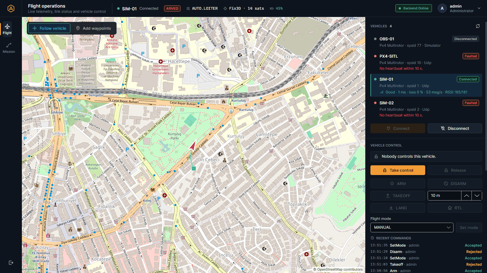

# Arayüz Yenileme Rehberi: tasarım sistemi, yeni ekranlar ve "Lost · 0 msg/s" hatası

Bu çalışmada masaüstü uygulamasının (Avalonia, `src/Gcs.Desktop`) görünümünü baştan tasarladım. Uygulamanın
**ne yaptığı** değişmedi: aynı API çağrıları, aynı SignalR akışı, aynı giriş mantığı. Değişen şey **nasıl
göründüğü ve nasıl kullanıldığı**. Kararların gerekçesi [ADR-020](../adr/ADR-020-desktop-design-system.md)'de.



---

## 1. Önce token'lar: renkleri tek bir yerde tanımlamak

Eski kodda renkler görünümlerin içine dağılmıştı:

```xml
<Border Background="#16212C" ...>          <!-- bir yerde -->
<TextBlock Foreground="LimeGreen" ...>     <!-- başka yerde -->
```

Bir rengi değiştirmek için bütün dosyaları aramak gerekiyordu. Artık her şey `Themes/Tokens.axaml`'da:

```xml
<Color x:Key="Color.Accent">#F29C38</Color>
<SolidColorBrush x:Key="Brush.Accent" Color="{StaticResource Color.Accent}" />
```

Görünümler yalnızca **isimle** kullanıyor: `Foreground="{StaticResource Brush.Text.Secondary}"`. Buna **tasarım
token'ı** denir. Web dünyasındaki CSS değişkenlerinin (`--color-accent`) karşılığıdır.

Renk sistemi şöyle düşünüldü:

| Rol | Renk | Ne zaman |
|---|---|---|
| Yüzeyler | koyu lacivert/antrasit, 4 kademe | arka plan, paneller, hover |
| Amber | `#F29C38` | bir alandaki **tek** ana işlem (Sign in, Take control, Upload) |
| Soğuk mavi | `#5BA8E5` | seçim ve bilgi (seçili araç, açık toggle, bilgi kutusu) |
| Yeşil / sarı / kırmızı | başarı / uyarı / tehlike | durum: Connected, Reconnecting, Faulted, ARMED |

Önemli kural: **durum hiçbir zaman yalnızca renkle anlatılmıyor.** "Faulted" hem kırmızı hem de yazıyla yazıyor;
renk körü bir operatör de anlayabilmeli.

## 2. Fluent temasını atmadan yeniden boyamak

Avalonia'nın Fluent teması butonların, açılır listelerin, klavye odağının **davranışını** zaten iyi yapıyor. Onu
silmek yerine iki şey yaptım:

1. Fluent'in kendi paletini (`ColorPaletteResources`) token'lara eşledim. Böylece elle stil yazmadığım kontroller de
   (ComboBox açılır listesi, menüler, scroll bar) aynı renkte.
2. Kendi sınıflarımı yazdım. Örneğin ana buton:

```xml
<Style Selector="Button.primary">
  <Setter Property="Background" Value="{StaticResource Brush.Accent}" />
</Style>
<Style Selector="Button.primary:pointerover /template/ ContentPresenter#PART_ContentPresenter">
  <Setter Property="Background" Value="{StaticResource Brush.Accent.Hover}" />
</Style>
```

İkinci seçici neden bu kadar uzun? Çünkü Fluent, fare üstündeyken rengi butonun **şablonunun içindeki**
`ContentPresenter`'a veriyor. `/template/` "şablonun içine bak" demek. Butonun kendisine renk vermek yetmez, hover
anında Fluent'in rengi kazanır.

Kullanımı:

```xml
<Button Classes="primary" Content="Upload to vehicle" />
<Border Classes="badge danger"><TextBlock Text="ARMED" /></Border>
```

Sınıf bir **bağlamaya** da bağlanabilir. Araç satırındaki durum rozeti böyle renk değiştiriyor:

```xml
<Border Classes="badge" Classes.success="{Binding IsConnected}" Classes.danger="{Binding IsFaulted}">
```

## 3. İkonlar: küçük bir özel kontrol

İkon fontu eklemek yerine yaklaşık 40 ikonu 24×24'lük çizgi geometrisi olarak çizdim (`Themes/Icons.axaml`):

```xml
<StreamGeometry x:Key="Icon.Takeoff">M4 20 H20 M12 16 V4 M7 9 L12 4 L17 9</StreamGeometry>
```

`M` = kalemi oraya götür, `H`/`V` = yatay/dikey çiz, `L` = çizgi, `A` = yay. Bu geometriyi çizen `StrokeIcon`
kontrolü (`Controls/StrokeIcon.cs`) rengini **miras alıyor** (`TextElement.Foreground`). Bu yüzden butonun içindeki
ikon, buton devre dışı kalınca kendiliğinden soluklaşıyor; ayrı bir kod gerekmiyor.

## 4. Ekran düzeni: harita önce

Operatörün en çok baktığı şey harita. Yeni düzende:

```
┌──────┬────────────────────────────────────────────────────────┐
│ ray  │ üst bar: sayfa · seçili araç (link, ARMED, mod, GPS, pil) │
│      ├──────────────────────────────────────┬─────────────────┤
│Flight│ HARİTA (kalan bütün alan)             │ yan panel       │
│Miss. │  + yüzen araçlar (Follow, Waypoint)  │ (sayfa içeriği) │
└──────┴──────────────────────────────────────┴─────────────────┘
```

* **Navigasyon rayı** sekmelerin yerini aldı (Ctrl+1 / Ctrl+2). İki `RadioButton`, view model'deki
  `IsFlightPage` / `IsMissionPage` özelliklerine iki yönlü bağlı.
* **Üst bar** seçili aracın en önemli değerlerini her sayfada gösteriyor. Pencere daralınca (1380 px altı) GPS, mod
  ve pil gizleniyor; yarıdan kesilmiş metin göstermekten iyidir. Bunu code-behind'da pencereye `compact` sınıfı
  ekleyerek yaptım: `Classes.Set("compact", genişlik < 1380)`.
* Paneller artık yuvarlak kutular değil, **ince çizgiyle ayrılmış bölümler**. Her şeyi kutuya koymak ekranı
  kalabalıklaştırıyordu.

## 5. Boş, yükleniyor ve hata durumları

Bir ekran yalnızca "her şey yolundayken" değil, **bir şey ters gittiğinde** de anlaşılır olmalı:

| Durum | Eskiden | Şimdi |
|---|---|---|
| Hiç araç yok | boş liste | "No active vehicles" + nasıl kaydedileceği |
| Telemetri gelmedi | her yerde "—" | bilgi kutusu: "Connect it to see live data" |
| Backend koptu | durum çubuğunda küçük yazı | sarı "Backend Reconnecting" rozeti, araç satırlarında "Not live", üst bar soluk |
| Backend hatası | durum çubuğunda kırmızı satır | haritanın üstünde kapatılabilir hata kutusu |
| Giriş: alan boş | buton gri, neden belli değil | alanın altında "Enter your username." |

## 6. Hata: "Lost · 0 msg/s" ama telemetri akıyor

Araç listesinde bağlantı "Connected" iken kalite satırı "Lost · 0 msg/s" gösterebiliyordu. İki ayrı sebep buldum.

**Sebep 1: sıralama (backend).** Alıcı döngü bir UDP paketini şöyle işliyordu:

```
1. çerçeveleri çöz
2. her çerçeveyi işle  ← ilk HEARTBEAT burada geliyor → durum "Connected" → kalite anlık görüntüsü yayınlanıyor
3. çerçeveleri say     ← ama sayım ancak burada yapılıyor
```

Anlık görüntü 2. adımda alındığı için "hiç çerçeve gelmedi" diyordu: Lost, 0 msg/s. Düzeltme: saymayı (3) çözümden
hemen sonraya, işlemeden (2) önceye aldım. Önce bunu yakalayan bir test yazdım; test eski kodda kırmızı, yeni kodda
yeşil (`The_status_reported_for_connected_already_counts_the_heartbeat_frame`).

**Sebep 2: izlenmeyen bağlantı (masaüstü).** Masaüstü iki SignalR hub'ına bağlanıyor: telemetri ve araçlar. Bağlantı
kalitesi **araçlar** hub'ından geliyor, ama kod yalnızca telemetri hub'ının kopup kopmadığına bakıyordu. Araçlar hub'ı
tek başına koparsa telemetri akmaya devam ediyor, kalite satırı ise son değerde (örneğin "Lost · 0 msg/s") donup
kalıyordu. Ayrıca SignalR varsayılan olarak ~42 saniye sonra yeniden denemeyi bırakıyor. Şimdi:

* iki hub da izleniyor; "Online" ancak **ikisi de** bağlıyken,
* yeniden deneme hiç bırakılmıyor (0, 2, 5 s, sonra her 10 s),
* SignalR'ın vazgeçtiği bir hub yeniden başlatılıyor.

Ders: **bir değerin "güncel" olduğunu varsaymak yerine, güncel olmadığını gösterebilmek.** Bu yüzden satırlara
"Not live" işareti de eklendi.

## 7. Ekranları nasıl doğruladım?

Kodu okuyup "güzel görünüyordur" demek yetmez. Gerçek pencereleri, çalışan backend'e bağlı olarak **headless**
(ekransız) modda çizip PNG olarak kaydettim:

```csharp
AppBuilder.Configure<App>().UseSkia()
    .UseHeadless(new AvaloniaHeadlessPlatformOptions { UseHeadlessDrawing = false })
    .SetupWithoutStarting();
var window = new MainWindow { DataContext = viewModel };
window.Show();
window.CaptureRenderedFrame()?.Save("flight.png");
```

Böylece masaüstüne tuş göndermeden, giriş hatası, boş alan uyarısı, onay penceresi, backend'i durdurup "Not live"
durumu ve dar pencere gibi durumları tek tek görüp düzelttim. `docs/images/gcs-desktop-*.png` bu yolla üretildi.

## Özet

* Renk, boyut, yazı tipi → **token** (tek yer).
* Görünüm → **sınıf** (`primary`, `badge danger`, `section`...).
* Fluent'in davranışı korunur, yalnızca görünümü değişir.
* Durumlar (boş, yükleniyor, hata, güncel değil) açıkça gösterilir; renk tek başına anlam taşımaz.
* Bir hata önce testle yakalanır, sonra düzeltilir.
