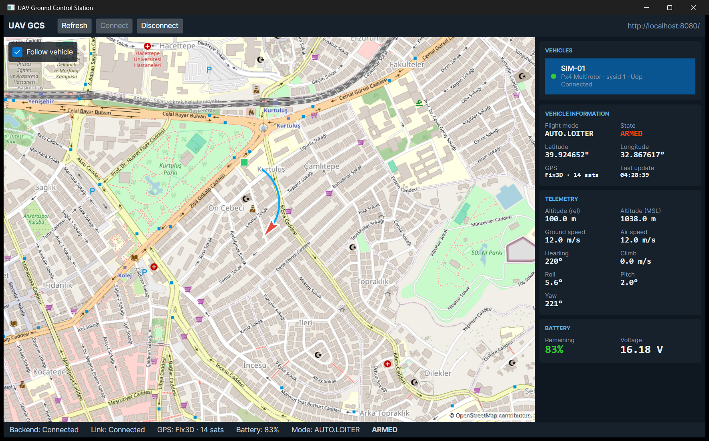

# Phase 5 Rehberi: Avalonia masaüstü GCS

Phase 1–4'te arka planda çalışan her şeyi yaptık. Phase 5'te operatörün gördüğü ekranı yaptık:



Ekrandaki her şey gerçek: bu görüntü, bu bilgisayarda çalışan Docker stack'ine bağlı uygulamadan alındı. Simülatör
aracı Ankara'da 150 m yarıçaplı daire çiziyor. Kırmızı ok yönü (heading 220° = güneybatı), mavi iz son konumları,
yeşil kare ev konumunu gösteriyor.

---

## 1. Ekranın yerleşimi (senin metnindeki tasarım)

```
+-----------------------------------------------------------+
| Toolbar: Refresh · Connect · Disconnect      sunucu adresi |
+-------------------------------------+---------------------+
|                                     | VEHICLES            |
|            HARİTA                   | VEHICLE INFORMATION |
|      (OSM + ok + iz + ev)           | TELEMETRY           |
|                                     | BATTERY             |
+-------------------------------------+---------------------+
| Backend | Link | GPS | Battery | Mode | ARMED               |
+-----------------------------------------------------------+
```

## 2. MVVM: Ekran ile mantığı ayırmak

| Katman | Dosya | Ne yapar | Ne yapmaz |
|---|---|---|---|
| View | `MainWindow.axaml` | Görünüm, renkler, yerleşim | Hiç mantık yok |
| ViewModel | `MainWindowViewModel.cs`, `TelemetryViewModel.cs` | Veri, komutlar, biçimlendirme | Ekrana dokunmaz |
| Servisler | `GcsApiClient.cs`, `RealtimeClient.cs` | REST ve SignalR | Ekranı bilmez |

**Binding örneği:**

```xml
<TextBlock Text="{Binding Telemetry.GroundSpeed}" />
```

ViewModel'de `GroundSpeed = "12.0 m/s"` olunca ekran kendiliğinden güncellenir. View hiçbir zaman "şu label'ın
metnini değiştir" demez.

**Neden?** Ekranın davranışını **pencere açmadan** test edebiliyoruz. 15 yeni test var, örneğin:

- "Başka araç seçilince eski aracın aboneliği bırakılıp yenisine abone olunuyor mu?"
- "Seçili olmayan aracın telemetrisi ekranı değiştirmiyor mu?"
- "Araç bağlanınca Connect pasif, Disconnect aktif oluyor mu?"
- "Backend'e ulaşılamıyorsa uygulama çökmeden hata gösteriyor mu?"

Testlerde gerçek sunucu yerine sahte (`FakeApi`, `FakeRealtime`) nesneler veriyoruz. Arayüz (interface) kullanmanın
faydası tam burada.

### "Bilinmiyorsa 0 değil, — göster"

Telemetri gelmeden önce batarya alanında "0%" yazsaydı, operatör bataryanın bittiğini sanabilirdi. Bilinmeyen değer
için "—" gösteriyoruz. Bunu da test ediyoruz. Savunma sistemlerinde **"bilmiyorum" ile "sıfır" farklı şeylerdir.**

### Renkler bir anlam taşır

| Durum | Renk | Neden |
|---|---|---|
| ARMED | turuncu-kırmızı | Motorları açık bir araç ekrandaki en önemli bilgidir |
| Batarya < %25 | kırmızı | Dikkat çekmeli |
| Bağlantı: Connected / Reconnecting / Faulted | yeşil / turuncu / kırmızı | Tek bakışta filonun durumu |

## 3. UI thread kuralı

Avalonia'da (WPF'te ve çoğu UI framework'ünde de) ekran öğelerine **sadece UI thread'inden** dokunulabilir. SignalR
ise mesajları arka plan thread'inde getirir. Doğrudan güncellersek uygulama çöker veya rastgele hatalar verir.

```csharp
_realtime.TelemetryReceived += telemetry => _ui.Post(() => OnTelemetry(telemetry));
```

`IUiDispatcher` gerçek uygulamada `Dispatcher.UIThread.Post` çağırır. Testte ise işi hemen çalıştırır, böylece
testler Avalonia'ya ihtiyaç duymaz.

## 4. Bağlantı dayanıklılığı (istemci tarafı)

- **Backend henüz açık değilse:** Uygulama çökmüyor, 3 saniyede bir yeniden deniyor. Operatör GCS'yi önce açabilir.
- **Bağlantı koparsa:** SignalR `WithAutomaticReconnect()` ile kendisi yeniden bağlanıyor. Status bar'da
  "Backend: Reconnecting" görünüyor.
- **Yeniden bağlanınca:** SignalR grupları yeni bağlantıya taşınmaz. İstemci, abone olduğu araçları hatırlıyor ve
  yeniden abone oluyor. Bu adımı unutmak çok yaygın bir hata: ekran donmuş gibi kalır ama hata da vermez.

## 5. Harita kararı

Detay: [ADR-012](../adr/ADR-012-desktop-map-and-avalonia-version.md)

- **Mapsui 5.1** (MIT lisanslı): .NET'in en olgun harita kütüphanesi.
- **Avalonia 12 → 11.3'e indirdim.** Mapsui, Avalonia 11.3 ile derlenmiş ve test edilmiş. Bir kütüphaneyi yapılmadığı
  bir ana sürümle çalıştırmak, ancak ekranda ortaya çıkan çalışma zamanı hatalarına davetiye çıkarır. Avalonia 11.3
  yaygın kullanılan, olgun sürüm. Senin "hazır ve test edilmiş araçlar" isteğine de uygun.
- **Harita karoları (tile):** Şimdilik OpenStreetMap. OSM kullanım kuralları: uygulamayı tanıtan bir User-Agent ve
  her zaman görünen "© OpenStreetMap contributors" yazısı (sağ altta). İkisini de uyguladım.
- **Sahada internet olmaz:** Gerçek kullanımdan önce çevrimdışı harita paketi (MBTiles) veya GCS ağında kendi tile
  sunucumuz gerekecek. Harita katmanı tek bir yerde oluşturulduğu için değişiklik tek satır.

### Koordinat dönüşümü

Araç konumu WGS84 derece olarak geliyor (39.92°, 32.86°). Web haritaları ise **Web Mercator** (metre cinsinden düz
bir projeksiyon) kullanıyor:

```csharp
var (x, y) = SphericalMercator.FromLonLat(position.Longitude, position.Latitude);
```

Dikkat: fonksiyon önce **boylamı** (lon) alıyor. Enlem ile boylamı karıştırmak harita yazılımlarının en klasik
hatasıdır; araç bir anda Somali'de görünür.

## 6. Yakalanan hata: "Ok yanlış yöne bakıyor"

Bu phase'in en öğretici anı. İlk ekran görüntüsünde araç kuzeydoğuya gidiyordu (heading 32°), ama haritadaki üçgen
**batıyı** gösteriyor gibiydi.

İlk şüphe: kütüphane açıyı yanlış yönde (saat yönünün tersine) döndürüyor. Tahmin yürütmek yerine **ölçtüm**: küçük
bir betikle bilinen açılarda (0°, 32°, 45°, 90°, 135°, 180°, 270°) şekiller çizdirip resim olarak kaydettim.

Sonuç: Kütüphane **doğru** döndürüyordu. Sorun şekildeydi:

1. **Eşkenar üçgenin üç köşesi aynı.** 32° döndürülmüş bir üçgende hangi köşenin burun olduğu belli değil. Göz en
   "sivri" görüneni seçiyor ve yanılıyor.
2. İkinci denemede kullandığım **geniş kuyruklu çentikli ok** da aynı sorunu yaşattı. Kuyruğun iki ucu, gözün burun
   sandığı yerdi. Piksel koordinatlarından açıyı hesapladığımda ok doğru yöndeydi (32° istedim, ~38° ölçtüm), ama
   bakınca öyle görünmüyordu.
3. Son çözüm: **uzun, ince, uçak benzeri bir ok.** Her açıda tek bakışta doğru okunuyor.

**Dersler:**

- Bir hatanın sebebini tahmin etme, ölç. İlk tahminim (kütüphane hatası) yanlıştı.
- "Matematik olarak doğru" ile "operatör doğru anlıyor" farklı şeyler. Operatör ekranında bir ikonun yanlış okunması
  da bir hatadır. Uçağın yönünü ters anlayan bir operatör yanlış komut verebilir.

## 7. Uygulamayı çalıştır

```powershell
docker compose up -d --wait            # backend + simülatör
dotnet run --project src/Gcs.Desktop    # masaüstü istemci
```

1. Sağdaki listeden SIM-01'i seç (yoksa Phase 3 rehberindeki gibi kaydet).
2. **Connect**'e bas. Birkaç saniye içinde ışık yeşile döner, araç haritada belirir.
3. "Follow vehicle" işaretliyken harita aracı takip eder. Kaldırırsan haritayı serbestçe gezebilirsin.
4. Simülatörü durdur (`docker compose stop gcs-simulator`) ve ışığın turuncuya, sonra kırmızıya döndüğünü izle.

Farklı bir sunucuya bağlanmak için: `dotnet run --project src/Gcs.Desktop -- --api http://10.0.0.5:8080/`
