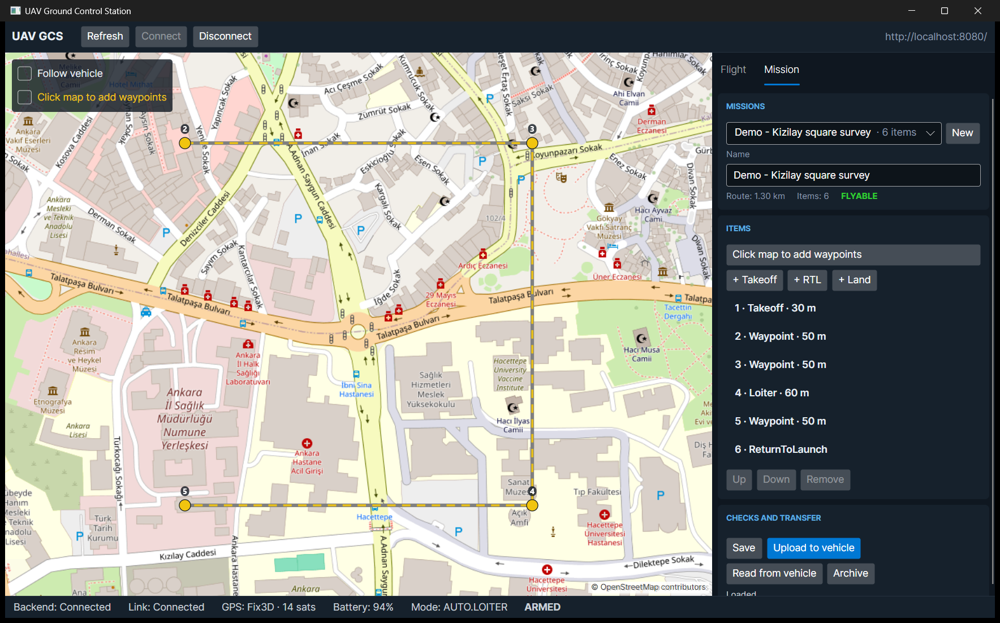

# Phase 6 Rehberi: Görev planlayıcı (Mission Planner)

Phase 5'te aracı izleyebiliyorduk. Phase 6'da araca **ne yapacağını** söyleyebiliyoruz: haritaya tıklayarak bir
rota çiziyorsun, sunucu bu planı kontrol edip saklıyor, MAVLink de planı araca yüklüyor.



Bu görüntü de gerçek. Bilgisayarındaki Docker stack'inde "Demo - Kizilay square survey" görevi var. Görev SIM-01'e
UDP üzerinden yüklendi ve araçtan geri okundu. Altı adımın hepsi aynı geldi.

---

## 1. Görev nedir?

Görev, aracın kendi başına uçtuğu sıralı bir adım listesidir:

```
1 · Takeoff · 30 m          → 30 m'ye kalk
2 · Waypoint · 50 m         → şu noktaya git
3 · Waypoint · 50 m, 12 m/s → bundan sonra 12 m/s hızla şu noktaya git
4 · Loiter · 60 m, 20 s     → şu noktada 20 saniye bekle
5 · Waypoint · 50 m         → şu noktaya git
6 · ReturnToLaunch          → eve dön
```

İrtifalar **evin üstündeki metre** cinsinden. Ankara deniz seviyesinden yaklaşık 900 m yüksekte. "50 m" deniz
seviyesinden 50 m demek olsaydı araç yerin altına uçmaya çalışırdı. Bu yüzden MAVLink'te `GLOBAL_RELATIVE_ALT`
çerçevesini kullanıyoruz.

## 2. Kontrolü kim yapar? İki seviyeli doğrulama

Şu iki hata aynı ağırlıkta mı?

* "İrtifa 900 m" (sınır 500 m)
* "Henüz Takeoff eklemedim"

Değil. Birincisi **yanlış veri**. İkincisi **henüz bitmemiş bir plan**. Operatör planı adım adım kurar, yarım plan
da normal bir durumdur. Bu yüzden kuralları ikiye ayırdık ([ADR-013](../adr/ADR-013-mission-storage-and-validation.md)):

| Seviye | Örnek | Ne olur |
|---|---|---|
| Alan kuralı | İrtifa 2–500 m, enlem ±90°, loiter'da bekleme süresi > 0 | `400 Bad Request`, hiçbir şey kaydedilmez |
| Uçulabilirlik kuralı | İlk adım Takeoff, son adım Land/RTL, en az bir waypoint | Kaydedilir ama `isFlyable = false` olur ve `issues` listesi döner |

Upload kapısı burada devreye girer. Uçulabilir olmayan bir görevi `POST /upload` hiç MAVLink trafiği başlatmadan
`409 mission.not_flyable` ile reddeder.

Bu kontrolü neden ekranda değil sunucuda yapıyoruz? API'yi yarın bir script, bir web arayüzü ya da başka bir ekip
de kullanabilir. Kurallar tek bir yerde, `Mission.Validate()` içinde durursa kimse onları atlayamaz.

## 3. Saklama: Neden ayrı tablo değil de JSONB?

Klasik yol `mission_items` diye ayrı bir tablo açıp her satıra bir `sequence` sütunu koymaktır. Biz adımları görevin
kendi satırında, `items` adlı bir JSONB sütununda tutuyoruz:

```json
[{"Command":"Takeoff","Altitude":30}, {"Command":"Waypoint","Latitude":39.9354,"Longitude":32.8572,"Altitude":50}, …]
```

Bunun üç nedeni var:

1. Adımlar hep görevle birlikte okunur ve yazılır. Tek başına bir adımı sorgulamıyoruz.
2. Sıralama dizinin sırasıdır. Bir adımı yukarı taşımak, ayrı tabloda tüm sequence numaralarını yeniden yazmak demek.
3. Tek satır, tek `Version` demek. Phase 2'deki ETag/If-Match mekanizması bütün planı korur. İki operatör aynı görevi
   aynı anda düzenlerse ikincisi `412` alır ve "başkası değiştirdi, yeniden yükle" mesajını görür. Kimsenin işi
   sessizce ezilmez.

## 4. MAVLink görev protokolü: Alıcı ister, gönderen verir

Görevi araca tek bir büyük paket halinde atmıyoruz. Önce kaç adım olduğunu söylüyoruz, sonra araç her adımı **tek
tek istiyor**:

```
GCS                                  Araç
 │── MISSION_COUNT (7) ─────────────►│   "7 adım göndereceğim"
 │◄──────────── MISSION_REQUEST_INT (0)   "0. adımı ver"
 │── MISSION_ITEM_INT (0) ──────────►│
 │◄──────────── MISSION_REQUEST_INT (1)
 │            … her adım için …
 │◄──────────── MISSION_ACK (ACCEPTED)    "hepsini aldım, tamam"
```

**Neden böyle?** Telsiz bağlantısı paket kaybeder. Bunu bir arkadaşına telefonda 7 haneli bir numara okumak gibi
düşünebilirsin. Hepsini bir solukta söylersen biri kaçabilir. "İlk hane?", "4", "İkinci?", "7" diye gidersen,
duyulmayan haneyi karşı taraf tekrar sorar. Bizim kodda da durum aynı:

* Her adımda 1,5 saniye cevap bekliyoruz. Cevap gelmezse son mesajı tekrar gönderiyoruz. 5 tekrardan sonra pes edip
  `vehicle.mission.no_response` dönüyoruz.
* Doğru bir cevap gelince sayaç sıfırlanıyor. Yani 100 adımlık bir görevde dağınık birkaç kayıp sorun olmuyor.
* **Aynı anda tek transfer.** Bir araca iki görev birden yüklenirse adımlar karışır. `MavlinkConnection` içindeki
  `_missionGate` buna izin vermiyor. İkinci istek `transfer_in_progress` hatası alıyor.
* Görev mesajları ayrı bir kutuya (`_missionInbox`) yönleniyor. Transfer sürerken telemetri akmaya devam ediyor.

### Çeviri (MissionItemMapper): Bizim model ile MAVLink arasındaki farklar

| Bizim modelde | MAVLink'te | Neden |
|---|---|---|
| (yok) | 0. sıra "home" yer tutucusu | ArduPilot 0. sırayı ev konumu için ayırıyor, PX4 de kabul ediyor |
| Waypoint + `speed: 12` | `DO_CHANGE_SPEED(12)` + `NAV_WAYPOINT` | MAVLink'te hız ayrı bir komut. Hız sadece değiştiğinde eklenir |
| Loiter + `holdSeconds: 20` | `NAV_LOITER_TIME` (param1 = 20) | |
| Konumsuz Takeoff/Land | lat/lon = 0/0 | "Aracın bulunduğu yer" anlamına gelir |

Araçtan geri okurken eşleme tersine çalışıyor: yer tutucu atılıyor, `DO_CHANGE_SPEED` bir sonraki waypoint'e
katlanıyor. Testlerde "yükle, sonra indir, aynı planı al" turunu doğruluyoruz. Bu testler gereksiz bir hız komutu
hatasını yakaladı ve çeviriyi kararlı (canonical) hale getirdik.

Mesaj kodlarını Phase 3'teki gibi **pymavlink ile bayt bayt karşılaştırdık** (golden frames). Burada öğrendiğimiz bir
ayrıntı şu: pymavlink'in encode fonksiyonu argümanları XML sırasıyla alıyor, kablodaki sırayla değil.

## 5. Bonus: API yeniden başlayınca bağlantıların geri gelmesi

Docker Desktop yeniden başladığında SIM-01'in bağlantısı kopmuştu ve kimse yeniden bağlamamıştı. Sahada bu kabul
edilemez. Sunucu güncellendi diye operatörün tüm araçları elle yeniden bağlaması gerekmemeli. Çözüm:

* Connect ve Disconnect artık operatörün **niyetini** kaydediyor (`vehicles.link_requested`).
* Uygulama açılırken `VehicleLinkRestorer` bu bayrağı taşıyan aktif araçları yeniden bağlıyor.
* Bir aracı emekliye ayırınca (retire) bayrak siliniyor.

Bugün demo stack'ini yeni sürüme geçirirken bunu canlı gördün. Bayrak yeni bir sütun olduğu için ilk seferde araçları
bir kez bağladım. Bundan sonraki her restart'ta kendileri bağlanıyorlar.

## 6. Masaüstü: Görev sekmesi

Sağ panel artık iki sekme: **Flight** (Phase 5) ve **Mission**.

| Dosya | Görevi |
|---|---|
| `MissionItemViewModel.cs` | Listedeki tek bir satır: komut, konum, irtifa, bekleme, hız, sunucudan gelen hata |
| `MissionPlannerViewModel.cs` | Görev listesi, düzenlenen plan, komutlar (Save, Upload, …), mesafe hesabı |
| `VehicleMap.cs` | Yeni bir katman: kesikli sarı rota çizgisi ve numaralı noktalar (seçili nokta turuncu) |
| `MainWindow.axaml.cs` | Harita tıklamasını koordinata çevirip `AddWaypointAt` çağırıyor |
| `ApiProblemException.cs` | Sunucunun hata belgesini okunur bir mesaja çeviriyor |

### Haritaya tıklayınca ne oluyor?

```
Fare (piksel: 512, 300)
   │  Map.Navigator.Viewport.ScreenToWorld
   ▼
Web Mercator (metre: 3 657 812, 4 856 233)
   │  SphericalMercator.ToLonLat
   ▼
WGS84 (derece: 39.9354, 32.8572)  →  planner.AddWaypointAt(...)
```

İki ayrıntı önemli:

* **Tıklama ile sürükleme farkı.** Haritayı kaydırmak da bir "bas, bırak" hareketidir. Fare 4 pikselden fazla
  hareket ettiyse bunu kaydırma sayıyoruz ve nokta eklemiyoruz.
* **Akıllı ekleme.** Yeni waypoint listenin sonuna değil, son RTL/Land adımının **önüne** ekleniyor. Böylece plan
  uçulabilir kalıyor. İrtifa da bir önceki waypoint'ten alınıyor; 80 m'de uçuyorsan yeni nokta da 80 m oluyor.

### ObservableCollection ve olaylar

`Items` bir `ObservableCollection`. Ekleme, silme ya da taşıma olduğunda liste kendiliğinden güncelleniyor. Haritanın
da yeniden çizilmesi gerekiyor. Ama harita bir binding hedefi değil, o yüzden ViewModel bir olay yayınlıyor:

```csharp
public event EventHandler? RouteChanged;   // adım eklendi/silindi/taşındı/konum değişti
public event EventHandler? MissionOpened;  // başka bir görev açıldı → haritayı rotaya yakınlaştır
```

View bu olaylara abone olup `_map.ShowMission(...)` çağırıyor. ViewModel haritayı hiç bilmiyor, o yüzden test
edilebilir kalıyor.

### Bugün yakaladığımız bir hata: Ondalık ayırıcı

İlk test çalıştırmasında şu test kırıldı:

```
should be "1.11 km"  but was "1,11 km"
```

Bilgisayarın Türkçe. `$"{metres / 1000:0.00}"` ifadesi o anki kültürü kullanıyor, Türkçede ondalık ayırıcı da
virgül. Ekranın geri kalanı nokta kullandığı için bunu `CultureInfo.InvariantCulture` ile sabitledik. Ters yönü de
düşündük: operatör kutuya `39,93` yazabilir. `NullableDoubleConverter` hem `39.93` hem `39,93` kabul ediyor, boş
kutuyu da "değer yok" (null) olarak okuyor.

**Ders:** Testleri farklı dilde bir makinede çalıştırmak bu tür hataları ortaya çıkarır. CI Ubuntu'da İngilizce
çalışıyor, o yüzden bu hatayı orada hiç görmezdik.

### Sunucu hatalarını okunur göstermek

Önceden bir hata olunca ekranda `Response status code does not indicate success: 400` yazıyordu. Şimdi
`ApiProblemException`, RFC 7807 hata belgesindeki `detail` ve alan hatalarını okuyor:

```
One or more mission items are invalid.
items[1]: Altitude must be between 2 and 500 m above home.
```

## 7. Kendin dene

1. Uygulamayı aç ve **Mission** sekmesine geç: `dotnet run --project src/Gcs.Desktop`
2. **New**'e bas ve haritaya 3–4 kez tıkla. Rota ve mesafe canlı olarak güncellenir.
3. Bir satırı seç, irtifayı `900` yap ve **Save**'e bas. Kırmızı hata mesajını gör.
4. İrtifayı düzelt. Takeoff satırını seçip **Remove** de, sonra **Save**'e bas. Görev kaydedilir ama "first item must
   be a takeoff" uyarısı çıkar ve **Upload** reddedilir.
5. **+ Takeoff** ekle, Flight sekmesinde SIM-01'i seç ve **Upload to vehicle** de.
6. **Read from vehicle** ile aracın hafızasındaki görevi geri oku.

API ile denemek istersen:

```bash
curl -s localhost:8080/api/v1/missions | python -m json.tool
```

## 8. Alıştırmalar

1. `Mission.Validate()` içine yeni bir uçulabilirlik kuralı ekle: "İki ardışık waypoint arası 5 km'yi geçemez."
   Önce testini yaz (`MissionTests.cs`), sonra kodu.
2. `MissionTransferOptions.MaxRetries` değerini 0 yapıp `MissionTransferTests` testlerini çalıştır. Hangi test neden
   kırılıyor?
3. Haritada RTL adımının eve dönüşünü de kesikli çizgiyle göstermek için `MainWindow.axaml.cs` ve
   `VehicleMap.ShowMission`'da neyi değiştirmen gerekir? (İpucu: ev konumu `VehicleMap._home` içinde.)

## 9. Sırada ne var?

Görevi araca yükledik ama henüz **başlatmıyoruz**. "Görevi başlat", "duraklat", "RTL", "arm", "kalkış" komutları
Phase 7'de gelecek. Bu komutlar aracı gerçekten hareket ettirdiği için yetkilendirme, onay ve denetim kaydıyla
birlikte tasarlanacak.
