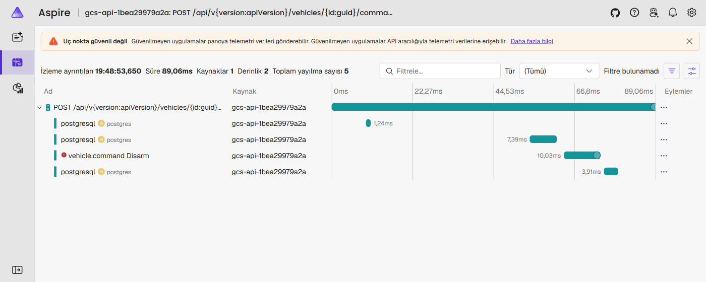

# Observability

How to see what the GCS is doing: traces, metrics, logs and health. Design decisions are in
[ADR-016](adr/ADR-016-observability.md).



## Quick start

```bash
docker compose up -d --build --wait     # includes the dashboard
# use the GCS (desktop or API), then open
http://localhost:18888                  # Traces, Metrics, Structured logs
```

An API started with `dotnet run` sends to the same dashboard if you set the endpoint (user-secrets or environment):

```bash
dotnet user-secrets set "Observability:OtlpEndpoint" "http://localhost:4317" --project src/Gcs.Api
```

| Setting | Default | Meaning |
|---|---|---|
| `Observability:OtlpEndpoint` | empty | OTLP/gRPC endpoint for traces, metrics and logs; empty means no export |
| `Observability:ServiceName` | `gcs-api` | `service.name` on every signal |
| `Monitoring:OutboxDegradedAfterSeconds` | 60 | outbox backlog age that makes `/health/details` Degraded |
| `Monitoring:OutboxUnhealthyAfterSeconds` | 600 | ... and Unhealthy (`503`) |

## Following one action

| You have | Do |
|---|---|
| A correlation id from an error message or the `X-Correlation-ID` response header | Traces → filter attribute `gcs.correlation_id` |
| A trace id from a log line (`[12:00:01 INF] 9f2c... 4bf92f3577b34da6a3ce929d0e0e4736 ...`) | open `/traces/detail/<trace id>` |
| A vehicle | Traces → filter `gcs.vehicle.id` |

What a command trace contains:

```
POST /api/v1/vehicles/{id}/commands                 Server   (gcs.correlation_id)
├─ postgresql  SELECT vehicles ...                   lease and vehicle lookup
├─ postgresql  INSERT command_audit (Pending)        write-ahead audit
├─ vehicle.command Arm                               Client   outcome, attempts
│     events: COMMAND_LONG sent (confirmation 0), COMMAND_LONG sent (confirmation 1)
└─ postgresql  UPDATE command_audit (outcome)
```

What an event trace contains:

```
POST /api/v1/vehicles                                Server
├─ postgresql  INSERT vehicles, INSERT outbox_messages (trace_parent stored)
└─ VehicleRegistered publish                          Producer (seconds later, on the dispatcher)
      → RabbitMQ message header traceparent = this span
```

Consumers of `gcs.events` should read the `traceparent` header and start their processing span as its child.

## Metrics

| Metric | Use it for |
|---|---|
| `gcs.commands{gcs.command, gcs.command.outcome}` | rejected or timed-out commands per type |
| `gcs.command.duration` | how long vehicles take to acknowledge; retries show up as long tails |
| `gcs.mission.transfers{direction, result}` | failed uploads |
| `gcs.mavlink.frames{gcs.vehicle.id}` | message rate per vehicle; a falling rate is a degrading radio link |
| `gcs.link.state_changes{state}`, `gcs.links{state}` | flapping links, how many vehicles are connected |
| `gcs.link.rtt`, `gcs.link.packet_loss`, `gcs.link.message_rate`, `gcs.link.radio.rssi` `{gcs.vehicle.id}` | link quality per vehicle (Phase 12): round trip (ms), loss over 10 s, messages/s, radio signal |
| `gcs.auth.logins{result}` | spikes of `invalid_credentials` or `locked_out` mean someone is guessing |
| `http.server.request.duration` | API latency per route and status |
| `db.client.*` (Npgsql), `dotnet.*` (runtime) | database pool, GC, thread pool |

## Health

| Endpoint | Auth | Checks |
|---|---|---|
| `/health/live` | none | process only |
| `/health/ready` | none | `postgres`, `rabbitmq` |
| `/health/details` | `read` | the above plus `vehicle-links`, `outbox-backlog`, `telemetry-history`, each with data |

```json
{
  "status": "Degraded",
  "checks": [
    { "name": "vehicle-links", "status": "Degraded", "description": "1 of 2 link(s) are not connected.",
      "data": { "total": 2, "connected": 1, "01a1...": "Faulted: No heartbeat after 5 reconnect attempts." } },
    { "name": "outbox-backlog", "status": "Healthy", "description": "0 event(s) waiting.", "data": { "pending": 0, "oldestAgeSeconds": 0 } }
  ]
}
```

Degraded still answers `200`: the API serves traffic, but monitoring should alert. Unhealthy (`503`) means something
is broken for other systems (for example, events not delivered for 10 minutes).

## Logs

Console lines carry the correlation id and the trace id:

```
[19:48:53 INF] 0HNG4... 648c44e68fcf31442f2c379aff4c5ea9 Gcs.Mavlink.Connections.MavlinkConnection: Vehicle ...: command Disarm -> Rejected after 1 attempt(s)
```

With an OTLP endpoint the same structured events appear in the dashboard under Structured logs, linked to their span.
