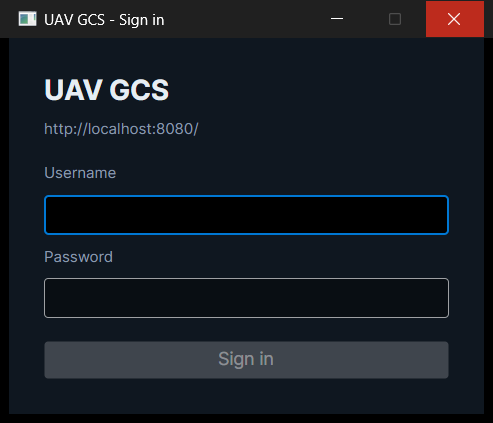
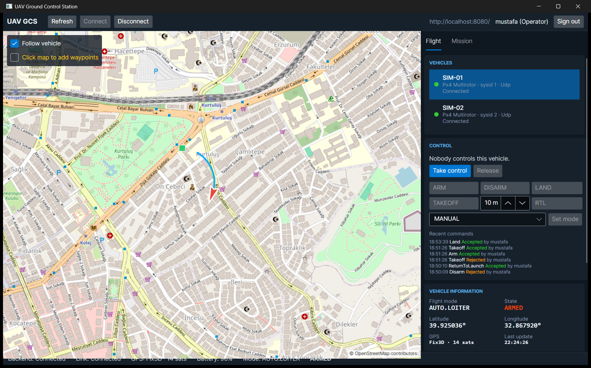

# Security

Who can use the GCS, what each person may do, and how the API protects itself. Decisions and trade-offs are in
[ADR-015](adr/ADR-015-authentication-and-authorization.md).



## Signing in

```http
POST /api/v1/auth/login
Content-Type: application/json

{ "username": "operator01", "password": "a-long-passphrase" }
```

```json
{
  "accessToken": "eyJhbGciOiJIUzI1NiIs...",
  "accessTokenExpiresAt": "2026-10-07T19:15:00Z",
  "refreshToken": "Qm9v...",
  "refreshTokenExpiresAt": "2026-10-08T07:00:00Z",
  "user": { "id": "...", "username": "operator01", "role": "Operator", "isActive": true }
}
```

Send the access token on every request as `Authorization: Bearer <accessToken>`. SignalR clients pass it with
`AccessTokenProvider` (sent as `access_token` on hub URLs).

| Endpoint | Purpose | Notes |
|---|---|---|
| `POST /api/v1/auth/login` | sign in | `401 auth.invalid_credentials` (same for unknown user and wrong password), `401 auth.locked_out` after 5 failures for 5 min |
| `POST /api/v1/auth/refresh` | new token pair | the refresh token is **single use**; reusing an old one revokes all of the user's sessions |
| `POST /api/v1/auth/logout` | end the session | idempotent `204` |
| `GET /api/v1/auth/me` | who am I | |
| `POST /api/v1/auth/password` | change own password | needs the current password; ends other sessions |
| `GET/POST /api/v1/users`, `GET/PUT /api/v1/users/{id}` | user administration | `users.manage` only; you cannot change your own role or deactivate yourself |

## Roles and permissions

| Permission | Observer | Operator | Maintenance | Administrator |
|---|:-:|:-:|:-:|:-:|
| `read`: fleet, telemetry, missions, leases, command audit log, SignalR | ✓ | ✓ | ✓ | ✓ |
| `vehicles.link`: connect/disconnect | | ✓ | ✓ | ✓ |
| `missions.plan`: create/edit/archive/upload missions, read a vehicle's mission | | ✓ | | ✓ |
| `vehicles.command`: take control, ARM/DISARM/TAKEOFF/LAND/RTL/SET_MODE | | ✓ | | ✓ |
| `vehicles.manage`: register/edit/retire vehicles | | | ✓ | ✓ |
| `users.manage` | | | | ✓ |

No token → `401`. Token without the permission → `403`. Anonymous: `/health/live`, `/health/ready`,
`/api/v1/system/info`, login/refresh/logout.

## Rate limits

| Limit | Default | Setting |
|---|---|---|
| everything (per user, or per IP before sign-in; health and hubs exempt) | 600/min | `RateLimiting:GlobalPerMinute` |
| login, refresh, logout (per IP) | 10/min | `RateLimiting:AuthPerMinute` |
| vehicle commands (per user) | 60/min | `RateLimiting:CommandsPerMinute` |

Over the limit: `429 Too Many Requests`, a `Retry-After` header and code `http.rate_limited`.

## Configuration and secrets

| Setting | Default | Secret |
|---|---|---|
| `Jwt:SigningKey` | none; required (random per run in Development only) | **yes**, ≥ 32 bytes |
| `Jwt:AccessTokenMinutes` | 15 | |
| `Jwt:RefreshTokenHours` | 12 | |
| `Jwt:Issuer` / `Jwt:Audience` | `gcs-api` / `gcs` | |
| `Security:BootstrapAdministrator:Username` | `admin` | |
| `Security:BootstrapAdministrator:Password` | none; first administrator is created only if set and no users exist | **yes**, ≥ 12 characters |

Secrets never go into `appsettings*.json` or the repository:

```bash
# local dotnet run
dotnet user-secrets set "Jwt:SigningKey" "$(openssl rand -base64 48)" --project src/Gcs.Api
dotnet user-secrets set "Security:BootstrapAdministrator:Password" "<a long passphrase>" --project src/Gcs.Api

# docker compose: put them in .env (git-ignored), see .env.example
JWT_SIGNING_KEY=<openssl rand -base64 48>
GCS_ADMIN_PASSWORD=<a long passphrase>
```

`docker compose` refuses to start without `JWT_SIGNING_KEY`. CI generates fresh values for every run.

After the first start, sign in as the bootstrap administrator and create personal accounts. Shared accounts make the
audit log meaningless.

## Response headers

`X-Content-Type-Options: nosniff`, `X-Frame-Options: DENY`, `Referrer-Policy: no-referrer`,
`Cross-Origin-Resource-Policy: same-origin`, `Content-Security-Policy: default-src 'none'; frame-ancestors 'none'`.
HSTS outside Development.

## Desktop client

The client starts with a sign-in window. Tokens are kept in memory only and renewed a minute before they expire. If
the server ends the session (expired, revoked, deactivated), the client returns to the sign-in window with the reason.
**Sign out** in the toolbar revokes the refresh token. The toolbar shows the user and role. Roles without
`vehicles.command` see the control panel but cannot take control.



## Deployment (Phase 11)

On a server the API sits behind Nginx ([deployment.md](deployment.md), [ADR-018](adr/ADR-018-deployment.md)):

* **TLS** 1.2/1.3 only, HTTP/2, HSTS for two years, no TLS handshake for unknown host names. Certificates from
  Let's Encrypt (port 80 opened only during the challenge) or an internal CA (ECDSA P-256).
* **Forwarded headers:** with `ReverseProxy:Enabled` the API takes the client address and scheme from
  `X-Forwarded-For`/`X-Forwarded-Proto`, **only** on connections from `ReverseProxy:TrustedNetworks` (in production
  Nginx's fixed address, `172.30.0.10/32`). Otherwise every client would share the proxy's login rate-limit bucket, or anyone could fake an address.
  Nginx overwrites `X-Forwarded-For` rather than appending to it.
* **Exposure:** UFW allows 443/tcp, the MAVLink UDP port and rate-limited SSH. Compose publishes only those two ports
  (Docker bypasses UFW for published ports). PostgreSQL and RabbitMQ are on an `internal` network.
* **Secrets** are generated on the server into `/etc/gcs/gcs.env` (0600 root) and kept across re-installs.
* **Backups** (`/var/backups/gcs`, 0700) contain password hashes and the audit log: root only, copy them off the host.

## Not yet covered

* Instant revocation of access tokens (today: within 15 minutes). See ADR-015.
* Shared rate-limit counters and leases for several API instances.
* MAVLink over UDP is neither authenticated nor encrypted; restricting it to the vehicles' network and MAVLink 2
  signing are Phase 12 topics.
* A security audit table for logins and user changes. Today they are structured log events (`Login failed for {Username}`,
  refresh-token reuse), shipped to the log store in Phase 9.
